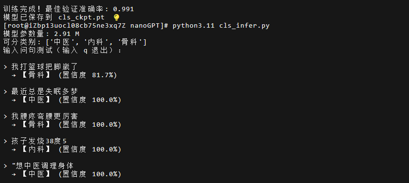

# med-route-nanomodel

本项目是一次轻量级文本路由模型的训练尝试。复刻 Andrej Karpathy 的 [nn-zero-to-hero](https://github.com/karpathy/nn-zero-to-hero) 与 [nanoGPT](https://github.com/karpathy/nanoGPT) 架构，从零构建了一个 Transformer 文本分类器，旨在验证其在医疗垂直领域中进行意图识别的能力。使用本项目自带的实验数据集，模型可在“骨科”、“内科”与“中医”三个类别中识别，用于对接 if/else 逻辑。



## 项目背景

在检索增强生成（RAG）系统中，意图识别与路由是决定回答质量的关键前置环节。系统需在接收用户输入后，迅速判定其所属领域（如骨科、内科、中医），进而将请求分发至对应的专业知识库。

本项目摒弃了对大型预训练模型 API 的依赖，转而采用 From Scratch（从零训练）的方式，构建了一个参数量约为 2.91M 的轻量级 Transformer 分类器。该模型具备以下特性：

*   **架构精简**：基于字符级（Char-level）Tokenization，无需依赖外部词表或预训练权重。
*   **数据驱动**：分类类别数（`num_classes`）由数据集自动推断，无需修改源码即可实现 N 分类任务的扩展。
*   **逻辑透明**：保留了 Self-Attention 与 MLP 的底层手写实现，便于深入理解 Transformer 的计算原理。

## 模型设计

本项目针对分类任务的特性，对标准的 nanoGPT（生成式架构）进行了如下关键调整：

| 对比维度 | nanoGPT (生成任务) | med-route-nanomodel (分类任务) |
| :--- | :--- | :--- |
| **输出层 (Head)** | 语言模型头，输出维度为词表大小 | 分类头，输出维度为类别数量 |
| **注意力掩码** | 包含因果掩码 (Causal Mask) | 移除掩码，允许 Token 关注全局上下文 |
| **特征提取** | 利用各位置输出进行序列生成 | 提取末位 Token 向量作为句向量进行分类 |

> **关于移除因果掩码**：生成任务需保证模型在预测时无法“看到”未来的信息，故使用因果掩码。而分类任务的目标是理解句子的完整语义，因此移除掩码以允许每个 Token 与上下文中所有 Token 进行交互，从而获得更全面的语义表征。

## 项目结构

```text
.
├── cls_model.py    # 模型定义：包含 Self-Attention、MLP、Block 及分类头
├── cls_prepare.py  # 数据预处理：执行 Tokenization 并划分训练/验证集
├── cls_train.py    # 模型训练：执行训练循环并保存最优权重
├── cls_infer.py    # 模型推理：加载权重对输入文本进行路由预测
└── data.jsonl      # 训练数据集（需用户自备，本项目自带一个3800行的实验数据集）
```

## 运行环境

本项目在以下环境中完成验证：

*   **云服务器**：阿里云 ECS
*   **GPU**：NVIDIA A10 (24GB) * 1
*   **配置**：8 vCPU / 30 GiB 内存
*   **操作系统**：Alibaba Cloud Linux 3.2104 LTS 64位（预装 NVIDIA GPU 驱动及 CUDA）

## 使用指南

### 1. 环境配置

通过阿里云内网镜像源安装 PyTorch 相关依赖，避免产生公网流量计费：

```bash
pip install torch torchvision torchaudio --index-url https://mirrors.cloud.aliyuncs.com/pypi/simple/ --trusted-host mirrors.cloud.aliyuncs.com
```

### 2. 数据准备

将训练数据 `data.jsonl` 上传至项目根目录。文件需采用 JSONL 格式，每行为一个独立的 JSON 对象，包含 `text` 与 `label` 字段：

```json
{"text": "腰疼弯腰更厉害", "label": "骨科"}
{"text": "孩子发烧38度5", "label": "内科"}
{"text": "想用中药调理脾胃", "label": "中医"}
```

> **数据格式校验提示**：通过大语言模型批量生成的数据集，常因括号闭合或标点符号问题导致 JSON 解析失败。建议在预处理前进行数据清洗，确保每一行均符合标准 JSON 语法规范。

### 3. 数据预处理

执行预处理脚本，将文本编码为数字序列，并生成包含字表与标签映射的 `cls_data.pkl` 文件：

```bash
python3 cls_prepare.py --input data.jsonl
```

### 4. 模型训练

执行训练脚本。训练过程中将实时输出训练集与验证集的损失（Loss）及准确率（Accuracy），并自动保存验证集表现最佳的模型权重 `cls_ckpt.pt`：

```bash
python3 cls_train.py --data cls_data.pkl --device cuda \
    --max_iters 3000 --batch_size 64 --n_layer 6 --n_head 6 --n_embd 192
```

**主要参数说明：**

| 参数 | 说明 | 默认值 |
| :--- | :--- | :--- |
| `--device` | 运行设备（`cuda` 或 `cpu`） | `cpu` |
| `--max_iters` | 最大训练步数 | `3000` |
| `--batch_size` | 批处理大小 | `64` |
| `--n_layer` | Transformer 层数 | `6` |
| `--n_head` | 注意力头数 | `6` |
| `--n_embd` | 嵌入向量维度 | `192` |

### 5. 推理验证

通过推理脚本对单条文本进行分类预测：

```bash
python3 cls_infer.py --text "我膝盖摔肿了"
```

## 系统集成

在实际业务中，可直接导入推理模块的 `route` 函数获取分类结果，以便进行后续的逻辑分发：

```python
from cls_infer import load_model, route

# 服务初始化阶段加载模型（避免重复加载）
model, stoi, id2label, block_size = load_model("cls_ckpt.pt", device="cpu")

def route_query(text):
    label, conf = route(text, model, stoi, id2label, block_size, device="cpu")
    
    if label == "骨科":
        # 分发至骨科知识库
        pass
    elif label == "内科":
        # 分发至内科知识库
        pass
    # ... 其他逻辑
```

## 局限性与展望

### 域外样本的过度自信问题

由于输出层采用 Softmax 函数，模型会强制将概率分布归一化至各已知类别。这导致当输入与训练领域无关的样本（Out-of-Distribution）时，模型仍会以较高的置信度将其错误归类。

**优化方向**：可通过引入“其他”类别的负样本进行训练，使模型具备拒识（Rejection）能力，从而有效拦截无关查询。得益于本项目的数据驱动特性，此优化仅需扩充数据集并重新训练，无需改动模型代码。

### 数据规模建议

鉴于本模型采用随机初始化的从零训练方式，对数据规模的依赖高于预训练模型微调。为保证模型的泛化能力，建议每个类别提供不少于 1000 条的标注样本。本项目提供3800条的医疗类 data.jsonl 作为实验文本，由 DeepSeek V4 Flash 生成。

## 致谢

本项目的架构设计与底层实现基于 Andrej Karpathy 的开源教程 [nn-zero-to-hero](https://github.com/karpathy/nn-zero-to-hero) 及 [nanoGPT](https://github.com/karpathy/nanoGPT) 。

## 许可证

本项目基于 [MIT License](LICENSE) 开源。
